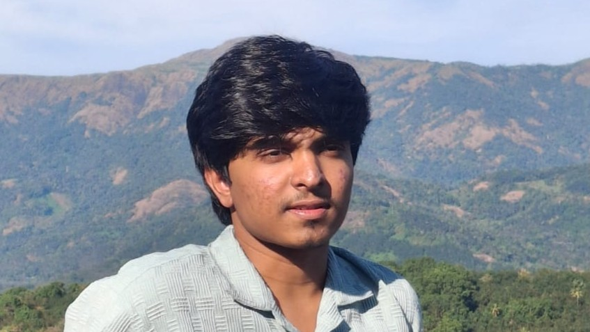

# Hi there, I'm JORDI MATHEW👋

I am an **Electronics and Communication Engineering** student with a passion for building systems that combine Technologies and are insanely useful and cool. My goal is to develop automation and robotics solutions that drive tangible change.

## 🚀 What I’m Interested
- **Robotics & Automation:** Combining deep neural workflows into physical systems to solve real-world problems.
- **Chip & PCB Design:** Designing efficient electronic systems, from schematic capture to physical layout having the potential to make electronic gadgets easy and efficient to use.
- **Bio-Engineering Research:** Exploring the intersection of deep learning and EEG-based motor imagery.

## 🛠️ Technical Toolkit
*   **Languages:** Python, C++, SQL, HTML/CSS
*   **Hardware/Embedded:** Arduino, ESP32, Raspberry Pi
*   **Design & Simulation:** LTspice, EasyEDA, ROS, Gazebo, PyBullet
*   **Tools:** Power BI, LaTeX, Flask, VS Code, MS Excel

## 🏆 Key Highlights
- **GeoGuide:** Developed a location-based assistant using Flask and SQL.
- **Hackathon Winner:** Secured 3rd place at the **Agentica Inter-College Hackathon**.

## 🧠 Beyond that
I believe that growth only happens at the edge of your comfort zone where nervous system adapts. When I'm not at my desk, you'll likely find me:
- **Challenging My Limits:** In the gym or on the **badminton** court or hyperfocused on something insane.
- **Side Quests:** Diving into **Psychology**, **Quantum physics**, **financial management**, **Tech updates**, **Netflix series/movies** and **Bio-Technology**.
- **Reading:** Currently exploring self-help and mindset books to optimize my performance.

## 😌Random Facts About Me
- MUSIC = relaxation 🎧
- I'm obsessed with Learning new things 🌐

## 🙋Contact Me
Feel free to drop me an email at jordimukhala@gmail.com or reach out on social media.

---

## 👇 Find me Online:
[LinkedIn](YOUR_LINKEDIN_URL) | [INSTAGRAM](YOUR_PORTFOLIO_URL) | [Email](mailto:jordi.m24@iiits.in)

---
*"Building things that actually matter."*
